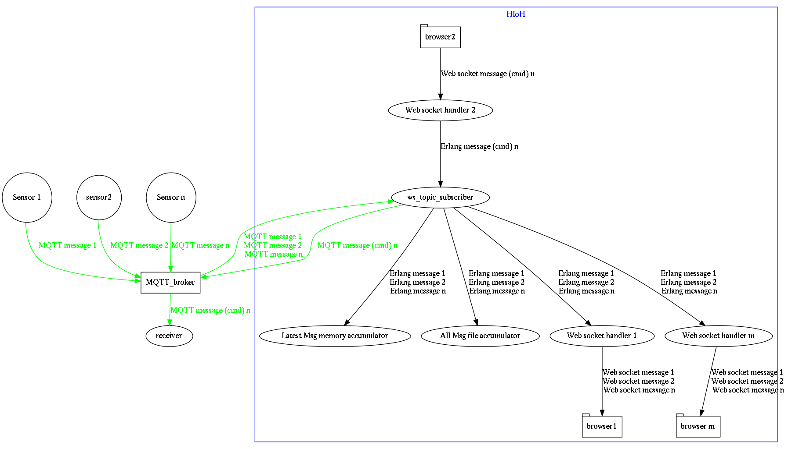

# HIoH (Home IoT Hub)

HIoH is a Web accesible Hub for interacting with IoT device data and programmed in Erlang.

## Prerequisites

Erlang > V17
An MQTT broker receiving sensor raw values


## Installation

Get the project:

```
git clone https://github.com/azku/HIoH
cd HIoH
```
Modify the config/sys.config file:
 
```erlang
[
 {sasl,[{errlog_type, error}]},
 {ws, [{topics, [[{topic,<<"/topic/to/subscribe2">>},
                  {fa,<<"fa-thermometer-quarter">>},
                  {name,<<"Livingroom Temperature">>},
                  {unit,<<"C">>}],
                 [{topic, <<"/topic/to/subscribe2">>}, 
                  {fa, <<"fa-umbrella">>}, 
                  {name, <<"Livingroom humidity">>}, {unit, <<37>>}]
                  ]},
       {http_port, 4002},
       {mqtt_host, "localhost"},
       {mqtt_client_id, <<"ws_mqtt_subscriber_client">>},
       {mqtt_username, <<"mqtt_username">>},
       {mqtt_password, <<"mqtt_password">>},
       {mqtt_logger_level, info}
      ]}
].

```

Notice the MQTT username and password needed to connect to the broker, the http_port in which the web server is going to run and the list of topics to subscribe. HIoH would expect the sensor messages to queue up in these topics.


Run the OTP application:

```
make run

```

Access the selected port via a modern browser and whatch the sensor data as its been received


## Goal

The main objective is to have a hub completely independent of all the devices in which you can monitor it all.
This indepence is bought at the expense of having a reliable protocol as a depencency. The MQTT protocol is believed to
be an adecuate fit for IoT and thus it's the one this project relies upon.


## Archtecture

As a picture is believed to be worth a thousand words...
 



## License

HIoH souce code is [licensed under the MIT](LICENSE.md).


## Copyright

(c) 2016, Asier Azkuenaga Batiz(c)
